# EDA - Fases 1 e 2 | alvo: `Listening_Time_minutes`

Gerado por `Pipeline/run_eda.py`. Tabelas completas em `tabelas/`, figuras em `figuras/`.

## Fase 1 - Carregamento de dados

Origem: `D:\Code\Disputa_gecida\train.csv` e `D:\Code\Disputa_gecida\test.csv`

### 1.1 Dimensoes e memoria

| dataset | linhas | colunas | memoria_MB | col_numericas | col_texto | celulas_nan_pct | linhas_com_nan_pct |
|---|---|---|---|---|---|---|---|
| train | 750000 | 12 | 281.7 | 6 | 6 | 2.59 | 28.13 |
| test | 250000 | 11 | 91.99 | 5 | 6 | 2.821 | 28.07 |

### 1.2 Integridade

| checagem | valor | status | observacao |
|---|---|---|---|
| alvo presente no train | Listening_Time_minutes | OK |  |
| NaN no alvo | 0 | OK |  |
| alvo ausente no test | True | OK |  |
| id unico no train | 0 | OK |  |
| sobreposicao de id train/test | 0 | OK |  |
| linhas duplicadas no train (sem id) | 0 | OK |  |

### 1.3 Alinhamento de colunas train/test

| item | quantidade | colunas |
|---|---|---|
| colunas comuns | 11 |  |
| so no train | 1 | Listening_Time_minutes |
| so no test | 0 |  |
| dtypes divergentes | 0 |  |

### 1.4 Estabilidade das distribuicoes (PSI)

PSI < 0.10 estavel | 0.10-0.25 atencao | > 0.25 deslocamento forte.

| coluna | nan_pct_train | nan_pct_test | psi | diagnostico | max_train | max_test | test_fora_do_intervalo_train | categorias_novas_no_test |
|---|---|---|---|---|---|---|---|---|
| Episode_Title | 0 | 0 | 0.0006 | estavel | - | - | 0 |  |
| Podcast_Name | 0 | 0 | 0.0002 | estavel | - | - | 0 |  |
| Episode_Length_minutes | 11.61 | 11.49 | 0.0001 | estavel | 325.2 | 7.849e+07 | 2 |  |
| Genre | 0 | 0 | 0.0001 | estavel | - | - | 0 |  |
| Host_Popularity_percentage | 0 | 0 | 0.0001 | estavel | 119.5 | 117.8 | 0 |  |
| Guest_Popularity_percentage | 19.47 | 19.53 | 0.0001 | estavel | 119.9 | 116.8 | 0 |  |
| Publication_Day | 0 | 0 | 0 | estavel | - | - | 0 |  |
| Publication_Time | 0 | 0 | 0 | estavel | - | - | 0 |  |
| Number_of_Ads | 0 | 0 | 0 | estavel | 103.9 | 2,063 | 1 |  |
| Episode_Sentiment | 0 | 0 | 0 | estavel | - | - | 0 |  |

**Atencao:** o test contem valores fora do intervalo observado no train (o PSI, por ser baseado em quantis, nao sinaliza esses casos):

- `Episode_Length_minutes`: 2 linha(s); max train 325.24 vs max test 78,486,264.00
- `Number_of_Ads`: 1 linha(s); max train 103.91 vs max test 2,063.00

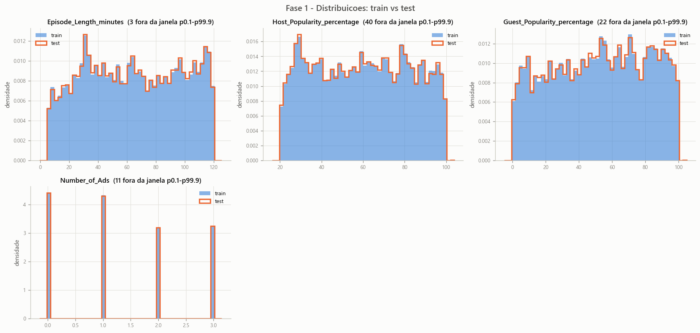

---

## Fase 2 - Analise Exploratoria (EDA)

> Engenharia de features fica fora deste escopo, conforme combinado.

### 2.1 Descricao das variaveis

Papeis detectados automaticamente: **4 numericas**, **5 categoricas**, **1 de alta cardinalidade**, **0 identificadores**, **0 constantes**.

| coluna | papel | dtype | n_preenchidos | n_nan | nan_pct | nunique | unicidade_pct | valor_dominante | dominante_pct | memoria_MB |
|---|---|---|---|---|---|---|---|---|---|---|
| id | id | int64 | 750000 | 0 | 0 | 750000 | 100 | 0 | 0 | 5.722 |
| Podcast_Name | categorica | object | 750000 | 0 | 0 | 48 | 0.006 | Tech Talks | 3.046 | 44.17 |
| Episode_Title | alta cardinalidade | object | 750000 | 0 | 0 | 100 | 0.013 | Episode 71 | 1.402 | 42.15 |
| Episode_Length_minutes | numerica | float64 | 662907 | 87093 | 11.61 | 12268 | 1.636 | 6.6 | 0.123 | 5.722 |
| Genre | categorica | object | 750000 | 0 | 0 | 10 | 0.001 | Sports | 11.68 | 40.34 |
| Host_Popularity_percentage | numerica | float64 | 750000 | 0 | 0 | 8038 | 1.072 | 38.68 | 0.075 | 5.722 |
| Publication_Day | categorica | object | 750000 | 0 | 0 | 7 | 0.001 | Sunday | 15.46 | 40.14 |
| Publication_Time | categorica | object | 750000 | 0 | 0 | 4 | 0.001 | Night | 26.25 | 40.02 |
| Guest_Popularity_percentage | numerica | float64 | 603970 | 146030 | 19.47 | 10019 | 1.336 | 68.53 | 0.05 | 5.722 |
| Number_of_Ads | numerica | float64 | 749999 | 1 | 0 | 12 | 0.002 | 0 | 29.01 | 5.722 |
| Episode_Sentiment | categorica | object | 750000 | 0 | 0 | 3 | 0 | Neutral | 33.51 | 40.53 |
| Listening_Time_minutes | alvo | float64 | 750000 | 0 | 0 | 42807 | 5.708 | 0 | 1.14 | 5.722 |

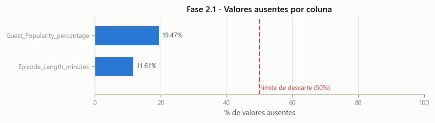

### 2.2 Distribuicao da variavel alvo

| metrica | valor |
|---|---|
| n | 7.5e+05 |
| media | 45.44 |
| mediana | 43.38 |
| desvio_padrao | 27.14 |
| minimo | 0 |
| p01 | 0 |
| p25 | 23.18 |
| p75 | 64.81 |
| p99 | 109.4 |
| maximo | 120 |
| skewness | 0.3508 |
| kurtosis (excesso) | -0.6612 |
| zeros_pct | 1.14 |
| negativos_pct | 0 |
| outliers_IQR | 0 |
| outliers_IQR_pct | 0 |
| p-valor normalidade (D'Agostino, n=5k) | 6.205e-74 |

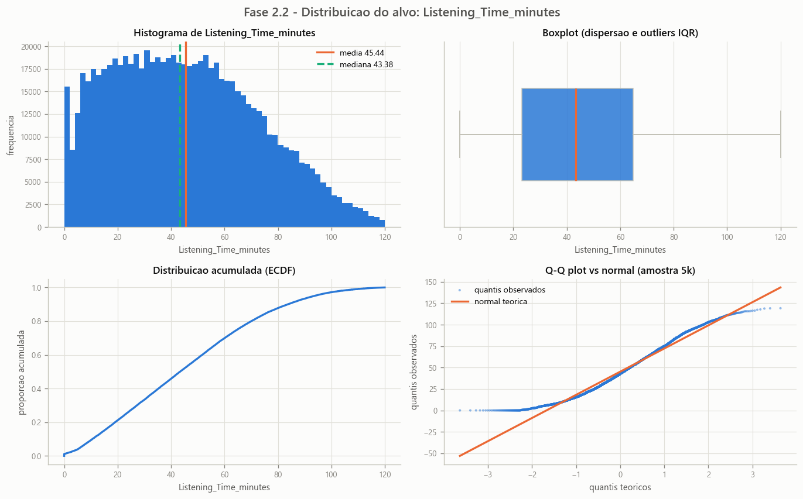

### 2.3 Variaveis numericas

| coluna | n | nan_pct | media | mediana | desvio | min | max | skew | kurtosis | iqr_inf | iqr_sup | outliers_iqr | outliers_pct | zeros_pct | n_valores_distintos |
|---|---|---|---|---|---|---|---|---|---|---|---|---|---|---|---|
| Episode_Length_minutes | 662907 | 11.61 | 64.5 | 63.84 | 32.97 | 0 | 325.2 | -0.002006 | -1.203 | -51.78 | 181.6 | 1 | 0 | 0 | 12268 |
| Host_Popularity_percentage | 750000 | 0 | 59.86 | 60.05 | 22.87 | 1.3 | 119.5 | 0.004926 | -1.207 | -20.77 | 139.7 | 0 | 0 | 0 | 8038 |
| Guest_Popularity_percentage | 603970 | 19.47 | 52.24 | 53.58 | 28.45 | 0 | 119.9 | -0.107 | -1.15 | -43.95 | 148.9 | 0 | 0 | 0 | 10019 |
| Number_of_Ads | 749999 | 0 | 1.349 | 1 | 1.151 | 0 | 103.9 | 6.033 | 505.9 | -3 | 5 | 9 | 0.001 | 29.01 | 12 |

**Correlacao de cada numerica com o alvo**

| coluna | pearson | spearman | n_pares |
|---|---|---|---|
| Episode_Length_minutes | 0.9167 | 0.9317 | 662907 |
| Number_of_Ads | -0.1183 | -0.1153 | 749999 |
| Host_Popularity_percentage | 0.05087 | 0.0454 | 750000 |
| Guest_Popularity_percentage | -0.01601 | -0.0145 | 603970 |

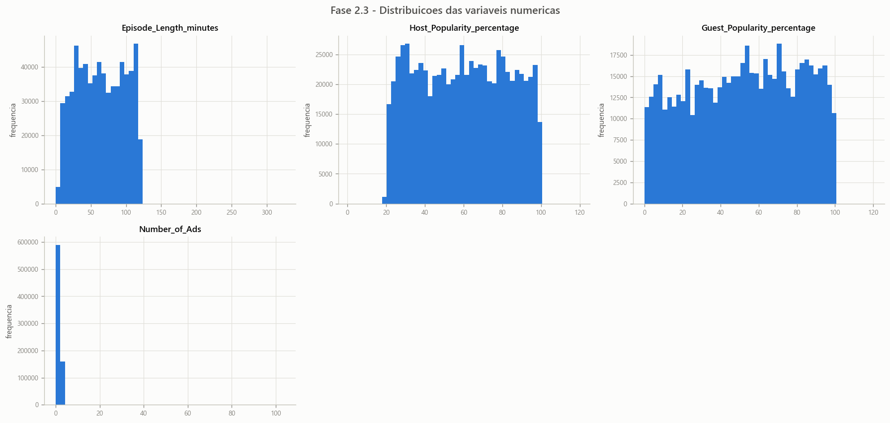

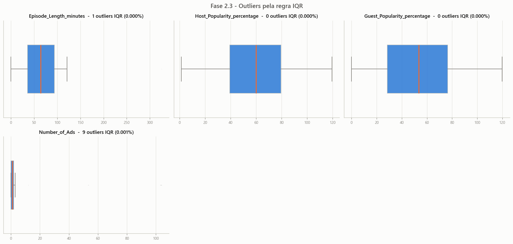

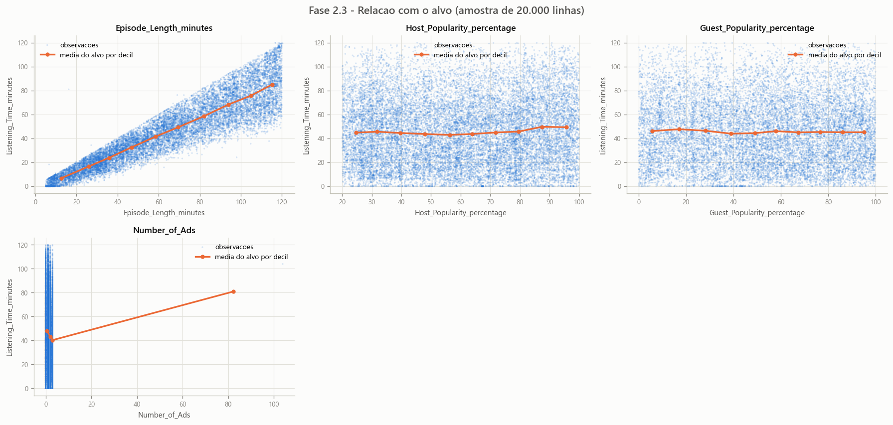

### 2.4 Variaveis categoricas

`eta2` = fracao da variancia do alvo explicada pela variavel (ANOVA de um fator).

| coluna | n_categorias | nan_pct | categoria_dominante | dominante_pct | media_alvo_min | media_alvo_max | amplitude_media_alvo | eta2_vs_alvo |
|---|---|---|---|---|---|---|---|---|
| Episode_Title | 100 | 0 | Episode 71 | 1.402 | 40.62 | 51.22 | 10.6 | 0.00583 |
| Podcast_Name | 48 | 0 | Tech Talks | 3.046 | 41.8 | 48.11 | 6.305 | 0.00263 |
| Episode_Sentiment | 3 | 0 | Neutral | 33.51 | 44.1 | 46.72 | 2.627 | 0.00156 |
| Publication_Time | 4 | 0 | Night | 26.25 | 44.76 | 46.46 | 1.695 | 0.00061 |
| Genre | 10 | 0 | Sports | 11.68 | 44.41 | 46.58 | 2.172 | 0.00055 |
| Publication_Day | 7 | 0 | Sunday | 15.46 | 44.82 | 46.13 | 1.314 | 0.00032 |

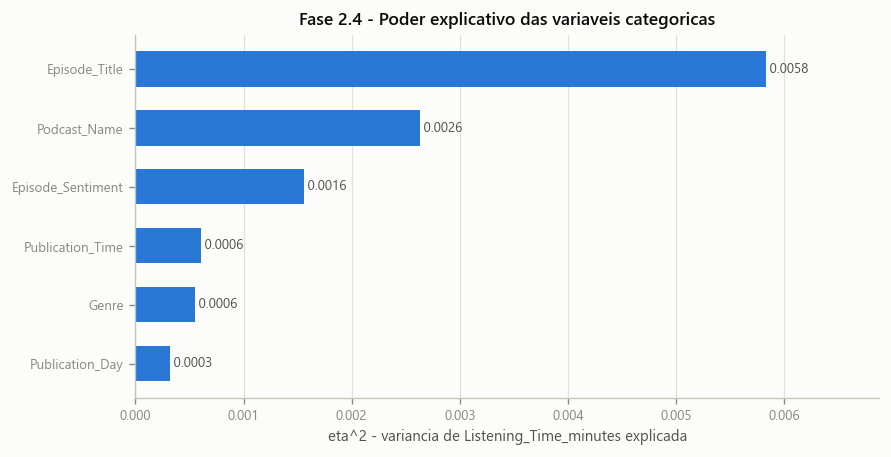

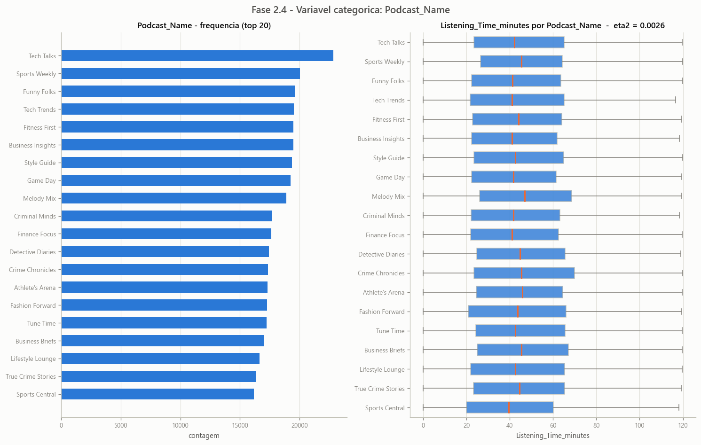

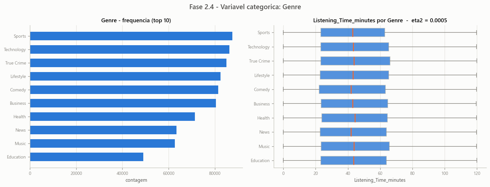

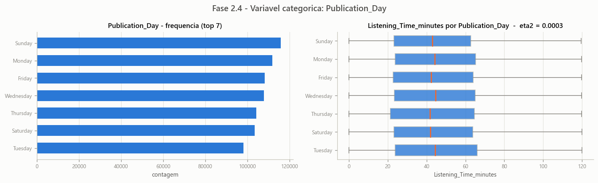

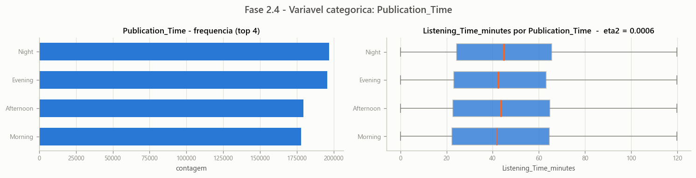

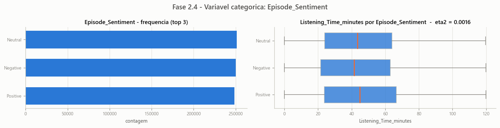

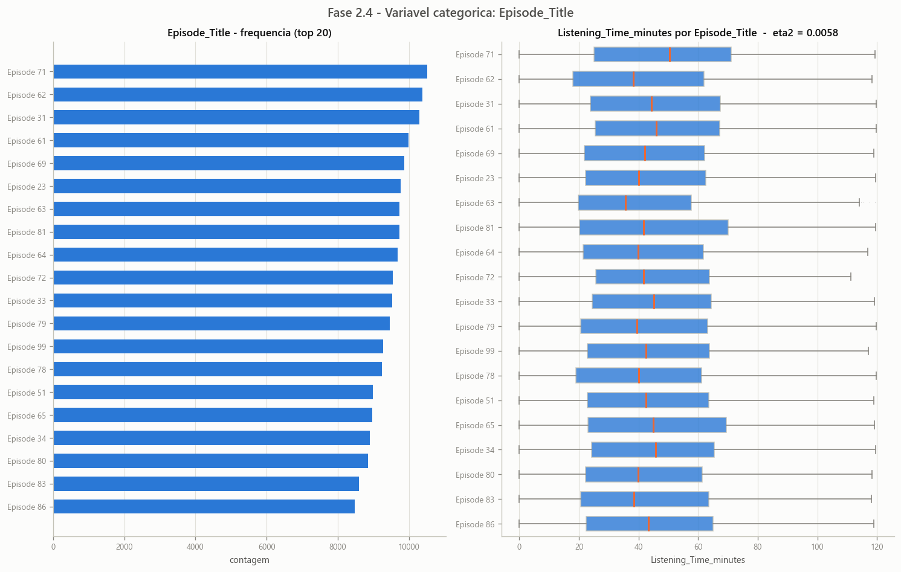

### 2.5 Matriz de correlacao

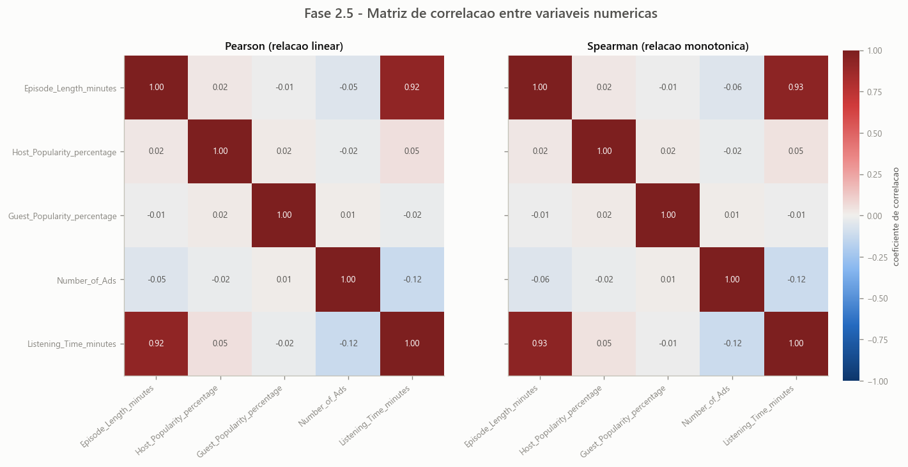

**Pares de preditoras acima do limite de redundancia (|r| >= 0.9); o alvo fica de fora**

_Nenhum par de preditoras redundante._

### 2.6 Alertas consolidados (entrada da Fase 3)

| severidade | coluna | achado | acao_sugerida |
|---|---|---|---|
| critico | Episode_Length_minutes <= 0 | 1 linhas violam a regra (0.000%) | inconsistencia logica - investigar antes de modelar |
| critico | Guest_Popularity_percentage | valores fora de [0, 100] (min 0.00, max 119.91) | valores impossiveis para um percentual - corrigir ou tratar como ausentes |
| critico | Host_Popularity_percentage | valores fora de [0, 100] (min 1.30, max 119.46) | valores impossiveis para um percentual - corrigir ou tratar como ausentes |
| critico | Listening_Time_minutes > Episode_Length_minutes | 2568 linhas violam a regra (0.342%) | inconsistencia logica - investigar antes de modelar |
| critico | Number_of_Ads > 10 | 9 linhas violam a regra (0.001%) | inconsistencia logica - investigar antes de modelar |
| atencao | Episode_Length_minutes | 87093 ausentes (11.612%) | imputar (mediana/moda/KNN) e criar flag de ausencia |
| atencao | Episode_Title | 100 categorias | OHE explode a dimensionalidade - usar target/ordinal encoding ou agrupamento |
| atencao | Guest_Popularity_percentage | 146030 ausentes (19.471%) | imputar (mediana/moda/KNN) e criar flag de ausencia |
| atencao | Number_of_Ads | 1 ausentes (0.000%) | imputar (mediana/moda/KNN) e criar flag de ausencia |
| atencao | Number_of_Ads | assimetria de 6.03 | avaliar transformacao (log1p, Box-Cox) para modelos lineares |
| info | Episode_Length_minutes | pearson 0.917 com o alvo | preditora dominante - verificar se nao ha vazamento e usar como baseline |
| info | Genre | eta2 = 0.00055 | praticamente nenhuma associacao com o alvo - baixa prioridade |
| info | Guest_Popularity_percentage | pearson -0.016 com o alvo | sinal linear desprezivel - checar relacao nao linear antes de descartar |
| info | Number_of_Ads | apenas 12 valores distintos | numerica discreta - considerar tratamento categorico |
| info | Publication_Day | eta2 = 0.00032 | praticamente nenhuma associacao com o alvo - baixa prioridade |
| info | Publication_Time | eta2 = 0.00061 | praticamente nenhuma associacao com o alvo - baixa prioridade |